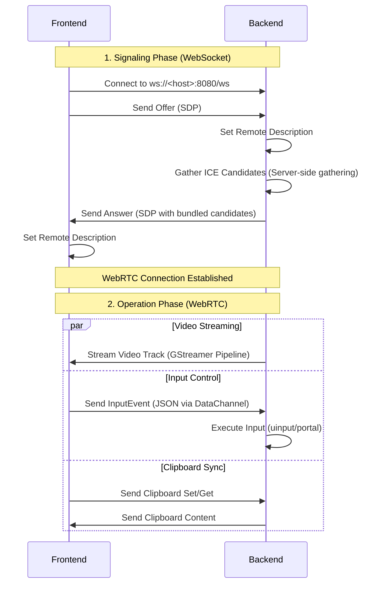

# Architecture Overview

This document provides a high-level overview of the WebRTC Remote Desktop application architecture. It explains how the frontend and backend interact, the protocols used, and the overall data flow.

## System Components

The system consists of two main components:

1.  **Frontend (Web Application)**: A standard web application (likely React/TypeScript) that runs in the user's browser. It displays the remote screen, captures user input (mouse, keyboard), and handles clipboard synchronization.
2.  **Backend (Rust Server)**: A Rust application that runs on the remote machine. It captures the screen, processes input events, and manages the WebRTC connection.

## Communication Channels

The frontend and backend communicate using two primary channels:

1.  **Signaling Channel (WebSocket)**: Used to establish the WebRTC connection.
    - **Protocol**: WebSocket
    - **Path**: `/ws`
    - **Format**: JSON

2.  **Media & Data Channel (WebRTC)**: Used for high-performance streaming and real-time control.
    - **Video**: One-way (Backend -> Frontend) stream of the desktop screen.
    - **Data Channel**: Bidirectional channel for control messages.
      - **Protocol**: JSON
      - **Usage**: Remote input events (mouse/keyboard), clipboard synchronization.

## Data Flow Diagram

## Signaling Flow

1.  **Connection**: The frontend connects to the backend WebSocket server.
2.  **Negotiation**:
    - The frontend creates a WebRTC `Offer` and sends it to the backend.
    - The backend accepts the offer, sets it as the remote description.
    - The backend generates an `Answer`, waits for all ICE candidates to be gathered (to simplify networking), and bundles them into the SDP.
    - The backend sends the `Answer` back to the frontend.
    - The frontend sets the `Answer` as the remote description, completing the connection.

## WebRTC Data Channels

A single Data Channel labeled `"data"` is used for all non-media communication.

- **Ordered**: `false` (Unordered communication for lower latency, especially for input events).
- **MaxRetransmits**: `0` (Fire-and-forget for input events to avoid head-of-line blocking).

## Key Technologies

- **Frontend**: React, TypeScript, Native WebRTC API.
- **Backend**: Rust, `axum` (Web Framework), `webrtc-rs` (WebRTC implementation), `gstreamer` (Video capture/encoding).
